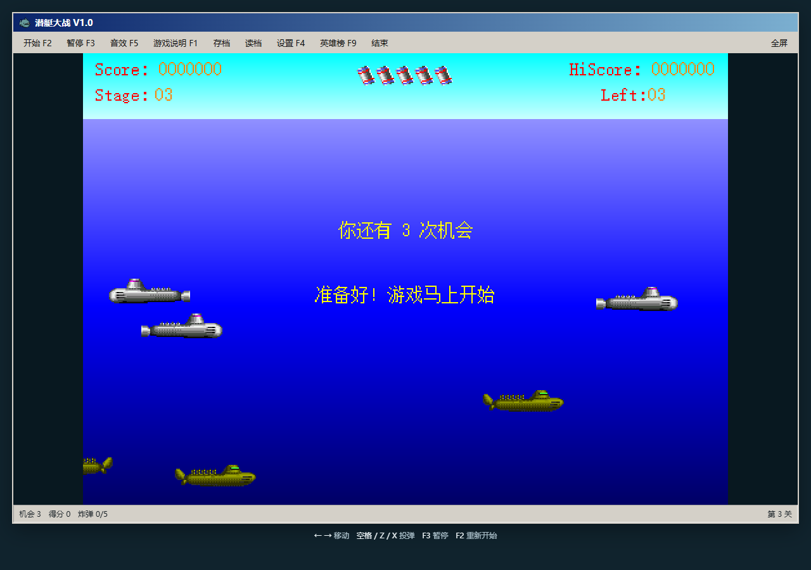
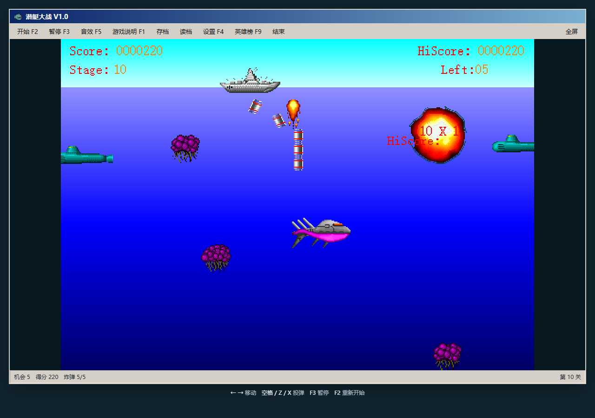
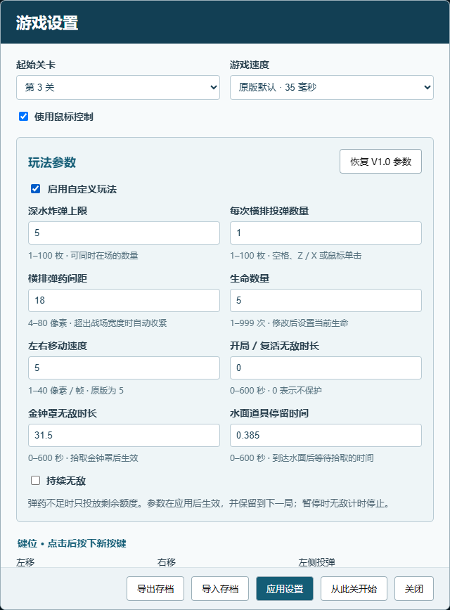

# 潜艇大战 V1.0 · HTML 复刻

驾驶战舰投下深水炸弹，击毁敌人、躲避攻击、收集补给并挑战英雄榜。20 关循环海战，核武器拾取即生效。在原版逻辑基础上加入现代浏览器显示、可输入姓名的英雄榜、存档，以及弹药、生命、移动速度和无敌时长的自定义设置。

游戏函数由从原 EXE 解码的 x86 指令执行，图片与声音提取自原资源；Windows/MFC 服务由浏览器兼容层替代。默认关闭自定义玩法。

## 游戏截图



第 10 关：潜艇与喷火鱼混合海战。



自定义设置：弹药容量、横排投弹、生命、移动速度及保护时长。



## 开始游玩

1. 下载本仓库：在 GitHub 点击 **Code → Download ZIP**，解压全部文件。
2. 双击 `index.html`，使用 Microsoft Edge 或 Chrome 打开。
3. 点击“开始”或按 **F2**。无需安装依赖，也无需联网。

部署到 GitHub Pages 时，发布仓库根目录即可。请保留文件的相对位置；只下载一个 HTML 文件不能运行游戏。页面按窗口等比例缩放，支持全屏和小屏触控按钮；缩放不改变内部碰撞坐标。

## 完整游戏说明

### 目标、生命与关卡

移动战舰，用下落的深水炸弹命中海底敌人。炸弹需要时间下沉，应提前判断潜艇的行进方向；深水炸弹是常规武器，核武器是补给获得的清场武器。

原版初始 **5 次生命 / 进攻机会**。敌方攻击导致战舰被击毁，扣除一次机会后复活；机会耗尽则结束本局。击毁敌人、拾取奖励和过关获得得分，成绩达到排名门槛时可登上英雄榜。

共有 **20 关**，通关后回到第一关继续循环。过关由原版进度与战场状态判定，状态栏显示当前关卡和完成进度。可从设置指定任意起始关卡。

第 2 关起出现导弹潜艇，第 7 关起加入水母，第 10 关起加入喷火鱼；后期混合敌人增加挑战。V1.0 全程为海战，核弹拾取后立即炸毁场上的潜艇，没有核弹库存或向上发射操作。原版开局与复活没有保护时长。

### 默认操作

| 操作 | 键位 / 方式 |
|---|---|
| 左右移动 | ← / →；启用鼠标控制时跟随鼠标 |
| 左侧投弹 | Z |
| 中间投弹 | Space；鼠标单击 |
| 右侧投弹 | X |
| 开始 / 重新开始 | F2 |
| 暂停 / 继续 | F3 |
| 游戏说明 / 设置 | F1 / F4 |
| 音效 / 全屏 / 英雄榜 | F5 / F8 / F9 |
| 存档 / 读档 | Ctrl + S / Ctrl + L；顶部按钮 |
| 鼠标控制开关 | Ctrl + M；设置中的复选框 |
| 结束当前游戏 | Esc；顶部“结束” |

小屏使用下方触控方向与投弹按钮，其余功能使用顶部菜单。说明与设置可滚动；关闭说明后恢复原先的暂停状态。F2 会重新开始一局，使用已应用的起始关卡和参数。

### 武器容量

原版初始最多 **5 枚深水炸弹同时在场**。这里的上限表示正在下落 / 尚未退出的炸弹数量，不是整局只能发射 5 次；炸弹消失后可以继续发射。Z、Space、X 默认每次发射一枚。

V1.0 原版容量固定为 5 枚。想增加容量或一键投出横排弹药，可启用自定义玩法。

### 敌人介绍

下表为原版玩法的基础分值；连续击毁敌人时，原版连击计分会使分值成倍增长。

| 敌人 | 外观与行为 | 基础得分 | 首次出现 |
|---|---|---:|---|
| 侦察潜艇 | 绿色，不发射炮弹 | 10 | 第 1 关 |
| 水雷潜艇（V1.0 原说明称鱼雷潜艇） | 银色，从水下发射无追踪水雷 | 20 | 第 1 关 |
| 导弹潜艇 | 深绿色，发射带追踪能力的导弹 | 30 | 第 2 关 |
| 黄金潜艇（加分潜艇） | 金黄色，不发射炮弹；驶向边缘后离场，炸毁会随机释放补给 | 40 | 第 1 关 |
| 水母（亦常称海葵） | 从水底上浮并靠近战舰；未受保护时碰撞会被击毁 | 50 | 第 7 关 |
| 喷火鱼 | 快速接近战舰，在船底附近发射火球 | 100 | 第 10 关 |

V1.0 的敌人范围为上述海战敌人，共 20 关循环。

### 宝物介绍

宝物需要战舰移动到其所在位置才能拾取。黄金潜艇释放的宝物会先上浮，在水面短暂停留后消失；可在自定义玩法中调整“水面道具停留时间”。

| 宝物 | 外观 | 拾取效果 |
|---|---|---|
| 无敌金钟罩 | 黄色笑脸 | 一段时间内保护战舰；自定义模式可设置保护时长 |
| 核武器 | 核弹图标 | 拾取即触发，立即炸毁场上的潜艇；无法储存备用 |
| 定子 | 钟表 | 暂时定住敌方舰船；仍需躲避它们发射的攻击物 |
| 猪头 | 猪头图标 | 立即奖励 2000 分 |
| 进攻机会（生命） | 钱袋 | 立即增加 1 次生命 |
| 标尺 | 梅子状图标 | 暂时显示位置标尺；原版可按数字键瞬移到相应位置 |

V1.0 原版没有增加炸弹容量和移动加速的上述两种宝物，炸弹容量固定为 5 枚；网页可通过自定义设置修改容量和速度。标尺的原版数字键瞬移在当前 V1.0 网页尚未接入。

## 设置与自定义玩法

点击“设置”或按 F4。起始关卡、速度、鼠标控制、姓名和键位可单独调整。设置不会仅因打开对话框而重置；点击“应用设置”才保存，直接关闭则放弃未应用的修改。

- **起始关卡：**可选第 1–20 关。“应用设置”保存选择；“开始”、F2 和刷新后使用该选择。“从此关开始”立即重新开始一局。
- **游戏速度：**默认每帧 35 ms；另有 1、21、41…181 ms 预设。间隔越短，整个游戏运行越快，实际速度受浏览器性能限制。
- **自定义玩法：**勾选后才能修改下列参数；未勾选时使用原版玩法。

| 参数 | 范围 | 自定义初始值 / 含义 |
|---|---|---|
| 深水炸弹上限 | 1–100 枚 | 5；同时在场容量 |
| 每次横排投弹数量 | 1–100 枚 | 1；Z / Space / X 或鼠标单击 |
| 横排弹药间距 | 4–80 原始像素 | 18；超过战场宽度时自动收紧 |
| 生命数量 | 1–999 次 | 5；修改后设置当前生命 |
| 左右移动速度 | 1–40 原始像素 / 帧 | 5 |
| 开局 / 复活无敌时长 | 0–600 秒 | 0；0 表示不保护 |
| 金钟罩无敌时长 | 0–600 秒 | 31.5，按默认速度换算 |
| 水面道具停留时间 | 0–600 秒 | 道具上浮后等待拾取的时长，暂停时停止计时 |
| 持续无敌 | 开 / 关 | 默认关闭 |

“应用设置”立即生效，并保存在当前浏览器，下一局继续使用。缩小容量会收回超出额度的在场炸弹；一次投弹数量超过剩余额度时，只投出可用数量。保护计时在暂停时停止，修改速度时保持剩余保护秒数。点击“恢复 V1.0 参数”后再应用，即可关闭自定义玩法。

## 英雄榜

成绩达到原版排名门槛时，弹出姓名输入窗口。输入姓名后点击“保存成绩”，按原版规则插入前十名；点击“不记录”或按 Esc 跳过。姓名支持最多 **6 个汉字或 12 个英文字母**，受原版 GBK 编码长度限制。设置里的姓名用于预填下次输入。

按 F9 或点击“英雄榜”查看名称、得分、过关和日期。英雄榜保存于当前浏览器本地，不是联网排行榜。

## 存档、导入与导出

顶部“存档”或 Ctrl + S 保存当前进度；“读档”或 Ctrl + L 恢复。当前浏览器只有 **一个进度存档位置**，再次保存会覆盖。设置中的“导出存档 / 导入存档”用于文件备份和迁移；英雄榜和设置另行保存在本地，进度文件不是全部浏览器数据的备份。

V1.0 原 EXE 没有游戏进度文件功能。网页增加 `.ship10` 格式，保存机器执行器状态、在场实体和自定义参数；只供本网页使用，不能在原 Windows EXE、V2.33 或蓝海版导入。

更换浏览器、移动网页路径、切换本地文件与网站地址，或清理浏览器数据，可能无法访问原有本地存档。迁移前请导出进度文件；GitHub Pages 不会自动把存档同步到其他设备。

## 常见问题

- **没有声音：**浏览器通常要求先点击页面或按操作键，之后再打开音效开关。
- **快捷键没有响应：**先点击游戏区域；关闭说明、设置等对话框后再操作。浏览器或系统占用的快捷键可改用顶部按钮。
- **画面两侧有留边：**游戏按原始宽高比显示，全屏也会保留必要的留边。
- **下载后无法运行：**确认 ZIP 已完整解压，HTML、JavaScript 和 `assets/` 保持原有目录结构。若浏览器限制本地文件，可在仓库目录运行 `python -m http.server 8000`，再打开 `http://localhost:8000`。

## 实现、开发与验证

内部逻辑画布为 **500×350**，默认更新间隔为 **35 ms**。网页显示按窗口和设备像素密度缩放，保持原资源比例。游戏本身没有构建步骤或在线依赖。

| 文件 / 目录 | 用途 |
|---|---|
| `index.html` / `game.js` | 界面、输入、显示缩放与对话框 |
| `cpu.js` / `machine.js` | 原版指令执行器、解码指令与数据 |
| `bridge.js` | Windows/MFC 绘图、音频及系统服务兼容层 |
| `tuning.js` | 可关闭的玩法参数扩展 |
| `resources.js` / `audio-data.js` | 内嵌图片与音效，支持本地打开 |
| `assets/` | 提取资源和 README 截图 |
| `docs/` | 资源清单、逆向说明和验证记录 |
| `tools/` | 提取与验证脚本 |

另有 `save.js` 负责网页进度存档。已检查 20 个原版关卡各 700 帧、自定义关卡各 300 帧、末关循环、100 枚横排弹药及末槽碰撞计分、核弹拾取清场、保护计时、设置持久化、姓名排名、跨页面读档和 320 / 390 像素对话框。6 个代表关卡与 Unicorn 执行原始机器码的结果交叉核对。

这些检查验证所测场景的指令与玩法状态，未穷举所有随机状态。交叉核对共用服务兼容层，不能证明其全部边界；没有完成与 Windows 原程序逐帧、逐音频采样对比。字体、GDI 绘制、混音和极高速帧率可能有差异，x87 使用 JavaScript 双精度计算。

重新提取与验证需 Python、pefile、Capstone、Pillow、Unicorn、Playwright，以及已安装的 Microsoft Edge：

```powershell
python -m pip install pefile capstone Pillow unicorn playwright
python tools/export.py D:\test\ship_V1.0.exe
python tools/verify_machine.py
python tools/test_game.py
```

## 原作与资源说明

原版作者：**汪海涛**，大头鸟软件工作室（Bighead Bird Program Studio）。来源文件为 `ship_V1.0.exe`，SHA-256：

```text
03756e0340b608bff99b889b351ff1d61397f4b62a3a830476845c59ed357d3b
```

原版程序压缩包：[ship_V1.0.zip](docs/ship_V1.0.zip)。原游戏、图片与声音的权利归原权利人；本仓库用于版本研究与浏览器复刻，未另行授予原版素材的授权。
